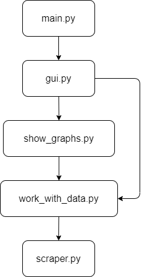

# Сбор и анализ статистики
## Описание
> Это учебный проект приложения, которое собирает статистику из раздела "Книжные лидеры продаж" книжного
> интернет-магазина "Лабиринт" https://www.labirint.ru и предоставляет возможность посмотреть некоторую
> сгруппированную статистику на графиках о книгах, издательствах и ценах по датам и за весь период сбора
> статистики. Приложение имеет графический интерфейс.
## Запуск
Графический интерфейс открывается после запуска модуля *main.py*. Все необходимые сторонние модули для
запуска указаны в *requirements.txt*.
## Структура

1. Модуль *main.py* использует модуль *qui.py* для запуска графического интерфейса.
2. Модуль *gui.py* реализует графический интерфейс с помощью библиотеки `customtkinter`. Для вывода графиков
используется модуль *show_graphs.py*. Для сохранения новых данных используется модуль *work_with_data.py*.
3. Модуль *show_graphs.py* реализует построение графиков с помощью библиотеки `matplotlib`. Для предоставления
нужных данных в удобном формате используется модуль *work_with_data.py*.
4. Модуль *work_with_data.py* реализует чтение/записи данных из/в файлы формата `csv` и формирование их в удобные
структуры с помощью библиотеки `pandas`. Данные сохраняются/читаются в/из каталога *data*. Для сбора данных с сайта
используется модуль *scraper.py*.
5. Модуль *scraper.py* реализует GET запросы к сайту с помощью библиотеки `requests`, а парсинг данных с помощью
библиотеки `bs4`.